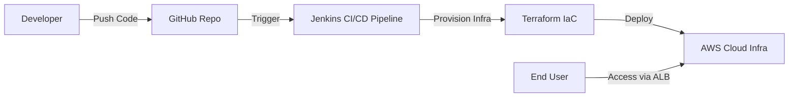

# 🪑SeatMatrix – Cloud-Native DevOps Pipeline on AWS
---
## 📌 Project Overview

**SeatMatrix** is a DevOps-focused project designed to demonstrate a clean, real-world CI/CD pipeline and AWS infrastructure architecture using Infrastructure as Code (IaC) and industry-standard tools.

The functional idea of SeatMatrix (library seat booking) is used only as a context, while the primary focus of this repository is on DevOps practices, cloud networking, CI/CD automation, and secure infrastructure design.

## 🌍Real-World Scenarios

### 🎓 Student Use Case
A student opens the SeatMatrix platform to check which library seats are currently available.  
They instantly see real-time seat status (vacant/occupied) and can choose the best seat before arriving, reducing time wasted searching for seats inside the library.

### 🏢 Library Owner Use Case
The library admin uses SeatMatrix to monitor seat occupancy, manage bookings, and track usage patterns throughout the day.  
This helps optimize seating capacity, reduce overcrowding, and maintain a transparent, efficient system without manual logs or in-person seat verification.

## 🎯 Project Objectives

- Design and deploy a secure, isolated AWS network using VPC, public/private subnets, IGW, and NAT Gateway.
- Implement an end-to-end CI/CD pipeline using GitHub → Jenkins → Terraform → AWS to demonstrate real-world DevOps automation.
- Provision all AWS resources through Infrastructure-as-Code (IaC) to ensure repeatability, version control, and zero manual configuration.
- Enforce least-privilege access and proper traffic flow: ALB for inbound public access and NAT Gateway for outbound private access.
- Deploy application workloads only within private subnets to achieve strong security posture and production-grade architecture.
- Demonstrate a scalable, maintainable deployment workflow aligned with AWS Well-Architected pillars: Operational Excellence, Security, Reliability, and Cost Optimization.

## 🧱 High-Level Architecture

This project follows a standard AWS Solutions Architect–approved architecture:

- Single AWS VPC
- Network isolation using public and private subnets
- Controlled inbound and outbound traffic
- Automated infrastructure provisioning
- CI/CD-driven deployment workflow

**Architecture Flow:**

---

## 🏗️ Architecture Components

### 🔹 Source Control
- **GitHub**
  - Hosts application and infrastructure code
  - Acts as the trigger point for the CI/CD pipeline

---

### 🔹 CI/CD Pipeline
- **Jenkins**
  - Pulls code from GitHub
  - Executes CI/CD workflow
  - Integrates with Terraform for infrastructure provisioning

---

### 🔹 Infrastructure as Code (IaC)
- **Terraform**
  - Provisions AWS infrastructure
  - Ensures repeatable, version-controlled deployments
  - Eliminates manual AWS resource creation

---

### 🔹 AWS Cloud Infrastructure

#### VPC
- Single AWS VPC used as the network boundary

#### Public Subnet
- **Internet Gateway (IGW)**  
  Enables inbound and outbound internet access

- **Application Load Balancer (ALB)**  
  - Handles inbound HTTP/HTTPS traffic
  - Acts as the only public entry point

- **NAT Gateway**  
  - Enables outbound internet access for private resources
  - No inbound access allowed

#### Private Subnet
- **SeatMatrix Application Service**
  - Deployed in a private subnet
  - Not publicly accessible
  - Receives traffic only via ALB

---

## 🔐 Security Principles Applied

- Application deployed only in private subnet
- No direct public access to application resources
- ALB acts as the single controlled entry point
- NAT Gateway used strictly for outbound traffic
- Infrastructure defined and audited via code

---

## 🛠️ Tools & Technologies Used

| Category | Tools |
|--------|------|
| Source Control | GitHub |
| CI/CD | Jenkins |
| Infrastructure as Code | Terraform |
| Cloud Provider | AWS |
| Networking | VPC, Subnets, IGW, NAT Gateway |
| Load Balancing | Application Load Balancer |

---
ScreenShots
---

### **1. Jenkins Pipeline**

### **2. ECS Cluster**

### **3. AWS Application Load Balancer**

### **4. AWS Target Group**

### **5. About SeatMatrix**

### **6. Home Page**

### **7. Explore Libraries**

### **8. Seat Map**

### **9. Seat Booking Modal**

### **10. Seat Booked Popup**

### **11. Owner Login**

### **12. Owner Dashboard**

### **13. Student Details (Owner Login Panel)**

### **14. Tech Stack**

## 📁 Repository Focus

This repository focuses on:

- DevOps workflow implementation
- CI/CD pipeline structure
- Infrastructure design and automation
- Cloud networking fundamentals

**Intentionally not included:**
- Backend logic
- Databases
- Authentication or authorization
- Application feature development

---

## 🧠 Learning Outcomes

By completing this project, the following DevOps concepts were implemented and reinforced:

- CI/CD pipeline design using Jenkins
- Infrastructure provisioning using Terraform
- AWS VPC networking fundamentals
- Secure inbound and outbound traffic control
- Separation of public and private resources
- Real-world DevOps architecture patterns

---

## 📌 Why This Project Matters

This project is intentionally simple but correct.

It demonstrates:
- Clear understanding of DevOps fundamentals
- Ability to design secure AWS architectures
- Practical use of CI/CD and IaC tools
- Industry-aligned implementation suitable for interviews

---

## 🌟 Thank You for Exploring SeatMatrix

Behind every technical project lies a simple intention — **to solve a real challenge in a meaningful way**.  
SeatMatrix started as a small observation in a library and grew into a complete cloud-native deployment pipeline.

If this work resonates with your vision of practical engineering:

⭐ Star the repo  
💬 Share feedback  
🔗 Connect with me 

🔗 Portfolio: https://vincloudops.tech

🔗 GitHub: https://github.com/Vin22-03

🔗 Linkedin: www.linkedin.com/in/vinayvbhajantri

**Vinay V Bhajantri**  
Cloud & DevOps Engineer  

> **“The best solutions are born from observing real struggles and deciding to fix them — one line of code at a time.”**

